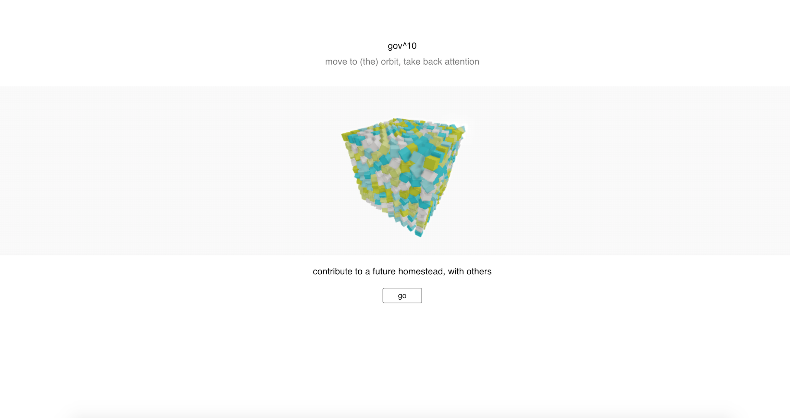
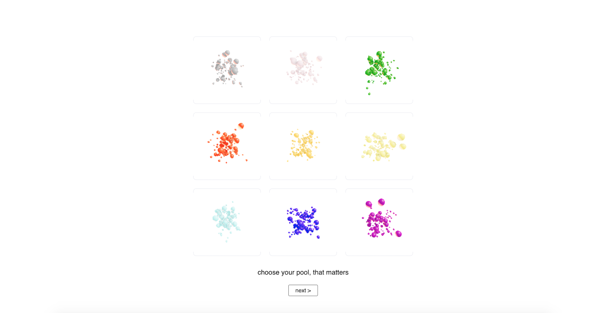
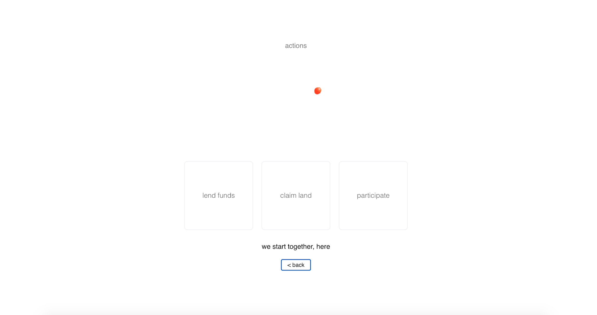
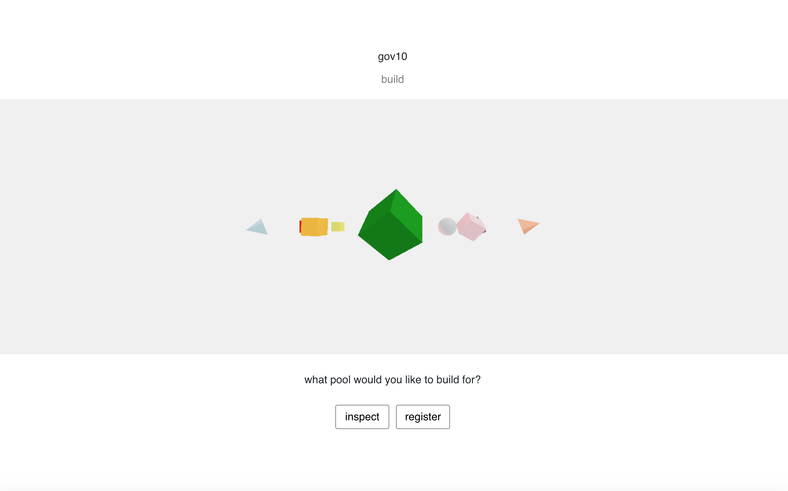
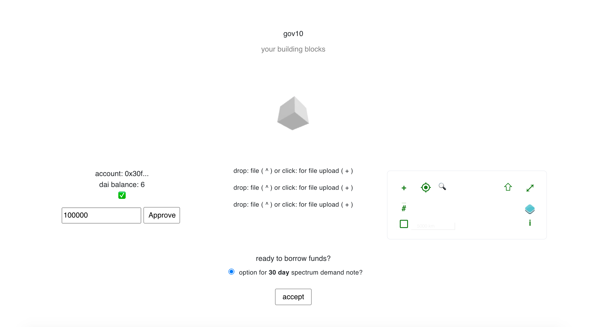
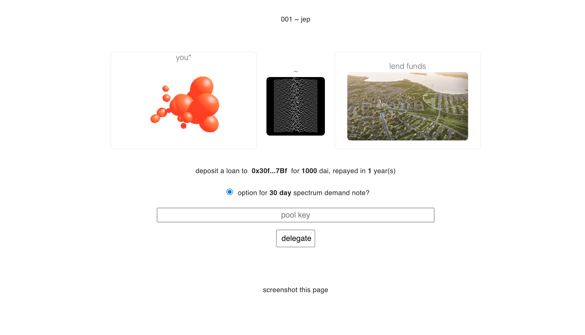
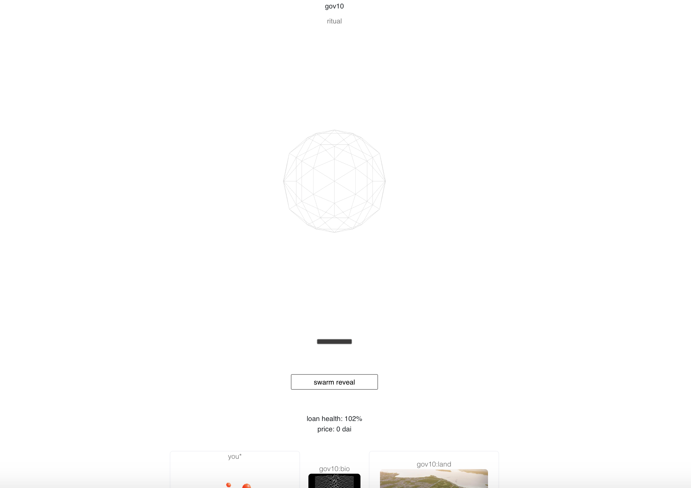
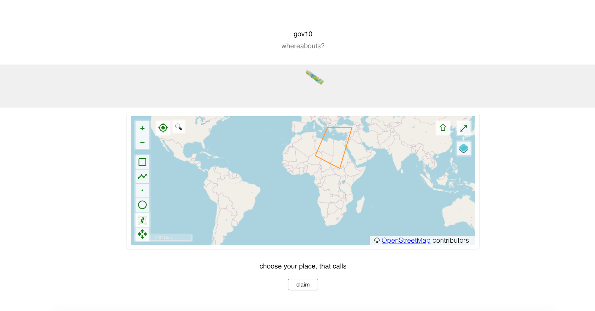

# gov10 :: flo governance

[current progress](http://159.203.37.102/)

The project uses aave as a staking protocol for delegating credit to land developers to build on claimed land. The tool has an integrative neuro ritual dashboard for contributing to those biohacker types that want to share data, in the meantime.

The project aims to bridge gaps of spirit (cognition), matter (land), and possibly media (art / nft). It is an experiment design with meme  discovery supported via NFTs and accumulated interest.

### home

### geflo :: neuro gene profiling UI

`ge` def : a brittle grey crystalline element that is a semiconducting metalloid (resembling silicon) used in transistors

### profile

### plan

### build matter

### delegate

### ritual swarm

### plot

