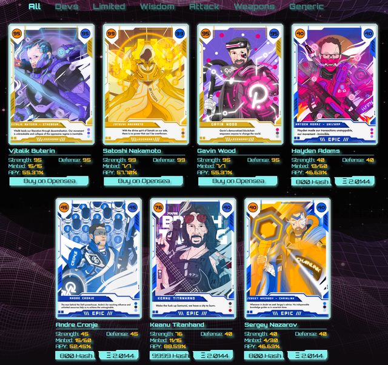

# Concept :: extending gov10

> I love fools' experiments. I am always making them. - Darwin

[tune in🎵](https://www.youtube.com/watch?v=HTY57CCKmYc)

*Geflo + Gov10* is a concept to be overlayed to an underlying infrastructure like a city. The purpose is to bootstrap new culture, housing, growing, & immigration in land development environments:

* E.g. sidewalk labs (urban in Toronto)
* The Orbit (urban/rural in Innisfil)
* cities affected by environmental issues (e.g. water rising in miami), 
* possible economic expansion (e.g. dubai), 
* or other or possible charter cities in unexplored territories (e.g. moonbase)

Certain components can be stripped away, but holistically together can create a type of asension in matter and value via new collaborations in business & gatherings in culture and people.

## Inputs
1. Provisioned Data :: neuring computation
2. Product :: molecular medicine 
3. Placement :: land
4. People :: functional biotechnology

Book Influences:
- Cryptocommunism
- Dark Matter and Trojan Horses
- Comparative Planetology
- The Gene

## Bootstrapped via Local Financial Credit
Overlaying mapping from AAVE Credit Delegation, applying the concept with a biotechnical lense, as one borrows via credit, paying back can be down via biofeedback data on the entity.

### Possible Analog Explanations (WIP)

#### Analog to Intelligence
- LSTM: long == vaccine, short == psychs
- Evolving Reinforcement Learning Algorithms: Process of Input, transformations, etc.

#### Biotechnology (PCR)
To consider the adminstration from the downstream of higher powers into the molecular biology of individuals, certain adminstration of long term drugs, like long-acting-injections e.g. vaccines or nootropics creates a type of ownership of an individual over a period.

#### Scaling
You might consider this as a type of optimistic rollup over a period of time, for the possible 'ownership' for an individuals speech, actions and carried interest might have after that individual work in a hiearchy or corporation.

In a new era of medicine, the neural enhancing and inflammation reduction benefits might be able to be administered, [without various perceptible issues](
https://www-forbes-com.cdn.ampproject.org/c/s/www.forbes.com/sites/amandasiebert/2021/01/18/betterlife-pharma-is-developing-second-generation-psychedelics-drugs-that-leave-out-the-trip/amp/), this will become more prevalent in the work place as new drugs are tried and tested.

From a financial context, this might be comparative to Carried Interest, typically used in contexts fo venture capital. Carried interest is a share of any profits that the general partners of private equity and hedge funds receive as compensation regardless of whether they contribute any initial funds. Because carried interest acts as a type of performance fee, it acts to motivate the the fund's overall performance.
From a Faith context, via sacrifice & desire.

**Therfore, combining Carried Interest with Biotech, we get Carried Genes as it relates to the downflow of carrying trust and interest in an individuals geneology.**

#### Gravitational Variations (non-exhaustive)
When considering the administration of such transformative medecines on an individuals geneology, is to consider the molecules containing spiritual materialistic affectors in that persons future, in that the supply chain of the sourcing and DNA might have lasting effects.

Various different examples:
- Spirit: Source + Trust. e.g. Community based or long lasting sources [wake.net](https://wake.net/)
- Elite: Molecular + Verification + Dark Matter e.g. Field Trip Health
- Faith: Molecular + Verification + Light e.g. public organizations e.g. Canadian Addiction Mental Health (CAMH)
- Cybernetic: Molecular + Verification + Sillicon e.g. brain-computer interfaces + biohacking

To be combined with land planning, seperate quadrant based factions might give way to consider these communities as an interplay that may best convolve to a differential optimum than any single approach via seperate geogrpahies or regulation that currently exists.

## gov10
The project to consider is to look at The Orbit. Since a 'tech withdrawal' is becoming more of a desirable path for youth and many, city exodus is becoming more of the norm.

## Consider the factions in such provisioned way:

  
  

## V1 visual selector, for property investment

## Requires profile for BCI
might extend [wiflo.us](http://178.128.237.136/)

  
  

## Product & Farming: Physical Growing + Art as NFTs
As concept outputs from borrowed credit, products that get produced would be either produced in physical as NFTs, or, artisticall via media and art, borrowing comunities from such places like reddit in the sub-reddit [/r/NFT](https://reddit.com/r/nft)

  
  

### Possible future integrations
FarmOS to transparently dictate value of credit owing.

  
  

## Aesthetics

  
  
  
  

